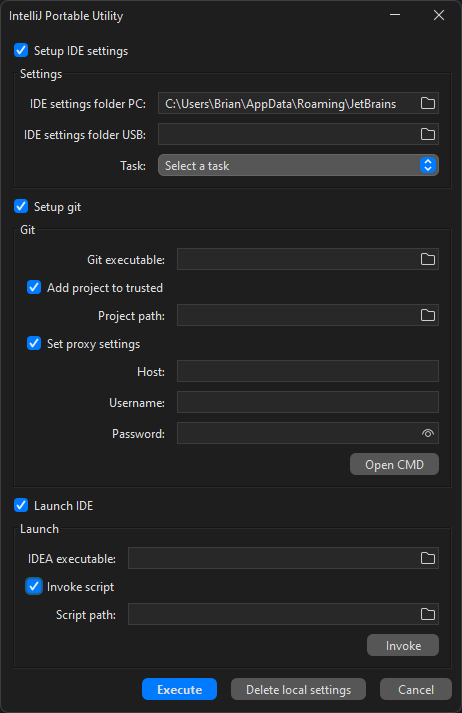

# IntelliJPortableUtility
Portable utility standalone for IntelliJ IDEA



## Overview

This is a utility to set up a minimal programming environment to work with IntelliJ IDEA even on a USB stick.

This utility has 2 main functions:
- Set IntelliJ settings
- Set up git

The program copies the settings from the USB stick to the user folder.
Since the stick can change drive letter, it is necessary to constantly adapt it in the paths of the JDKs and in the path of the git executable.
These settings are contained within the `git.xml` and `jdk.tables.xml` files, both contained within `IDEA_preferences\IdeaIC2022.3\options`.
To facilitate refactoring of these files, it is important that these two files are formatted in a particular way before running this utility.
Within these two files, in the paths referring to the stick, the drive letter must be replaced by `$TOKEN$`.

This utility also allows you to set some git settings:
- safe directory
- proxy settings

Finally, it is possible to start IntelliJ directly by providing the path to idea64.exe

## Installation

Download `IntelliJPortableUtility.exe` and place it on a USB drive.
To run the utility simply double-click on the exe file.

## Get started

For the first time you have to run IntelliJ as you normally do. Now set the JDK, git path and all the rest.
Once done, close IntelliJ and launch the utility. Enable the Settings module and set the paths appropriately. Select as task `Refactor and copy from PC to USB` and click on execute.

## Usage

The interface is pretty simple.
The window is divided into 3 main sections:
- Settings
- Git
-Launch IDE
Each of these sections can be enabled or disabled as needed.

### Settings
This module takes care of copying the IntelliJ settings and doing the refactoring.
- IDE settings folder PC: path to the folder containing the JetBrains tool settings on the local PC.
By default, this field is set to `C:\Users\<user>\AppData\Roaming\JetBrains`.
However, it is appropriate to change it in order to point to the folder containing the IntelliJ settings. Example: ```IdeaIC2022.3```.
If the folder doesn't exist, it tries to create it.
If it cannot be created, a runtime exception will be thrown.
- IDE settings folder USB: path to the folder containing the IntelliJ settings located on the usb key.
The name should look something like `IdeaIC2022.3`.
- Task: operation to be performed during execution.
This choice determines the order of operations performed.
When USB -> PC is selected, data is copied and then refactored, while when PC -> USB is selected, data is refactored and then copied.

### Setup git

Module that takes care of setting some basic git settings.

- Git executable: path to git.exe
- Project path: path of the project folder you want to work on. If this path is specified it can also be used by the Launch IDE module to start the IDE on the current project.
- Host: Proxy server host. You must specify the IPv4 address including the port.
- Username: username used to authenticate to the proxy
- Password: Password used for proxy authentication

### Launch IDE
Module that automates the opening of IntelliJ.

- IDEA executable: path to `idea64.exe`

***NOTE***: Starting IntelliJ from the utility limits ram usage to that set for the utility's JVM. For this reason IntelliJ may seem slower than usual. To fix this simply close the utility when done successfully.

## Other

This application persists the settings values to speed up the next run. The data is saved inside the `app.properties` file located in the same folder as the `IntelliJPortableUtility.exe`.

In case of errors it is possible to consult the log file generated by the execution of the application, also located inside the same folder of the utility.
